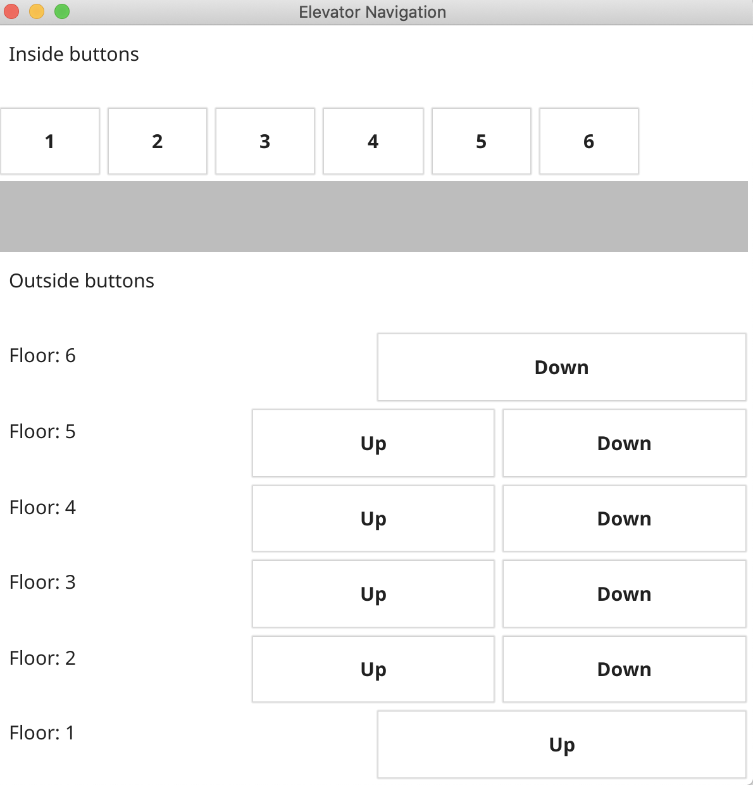

# Elevator Navigation App

## Description

The project designed with **Model-View-Controller** (MVC) pattern. [Fyne](https://developer.fyne.io/) (GUI) library used as a view component.

The building has 6 floors. Each floor has a button or buttons outside of the elevator to summon the elevator and tell it what direction a passenger wants to go. Floors 2-5 have up and down buttons, floor 1 has an up button only, and floor 6 has a down button only.

The elevator has buttons inside for passengers to tell it what floor they want to go to, so there are 6 buttons inside, one for each floor.

The simulation of the movement and waiting's has represented as console output.

## Running Instructions

`make run`

## Test & Coverage

`make test`

## Help

`make help`
